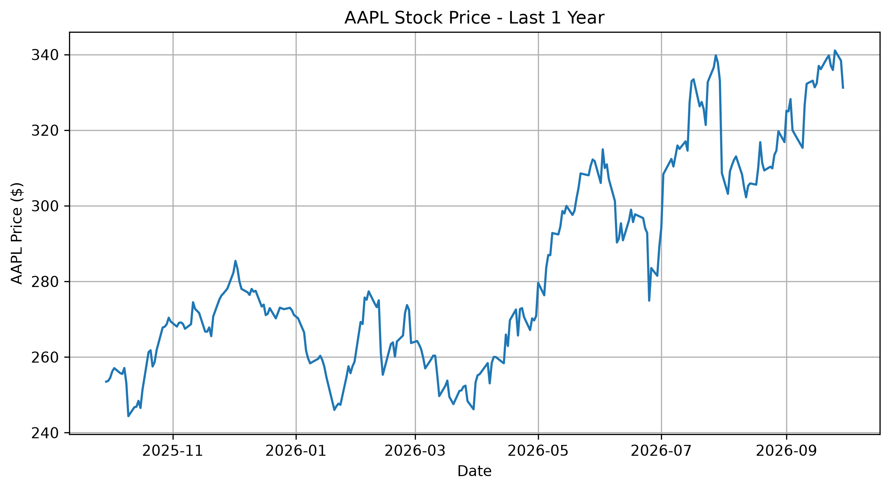
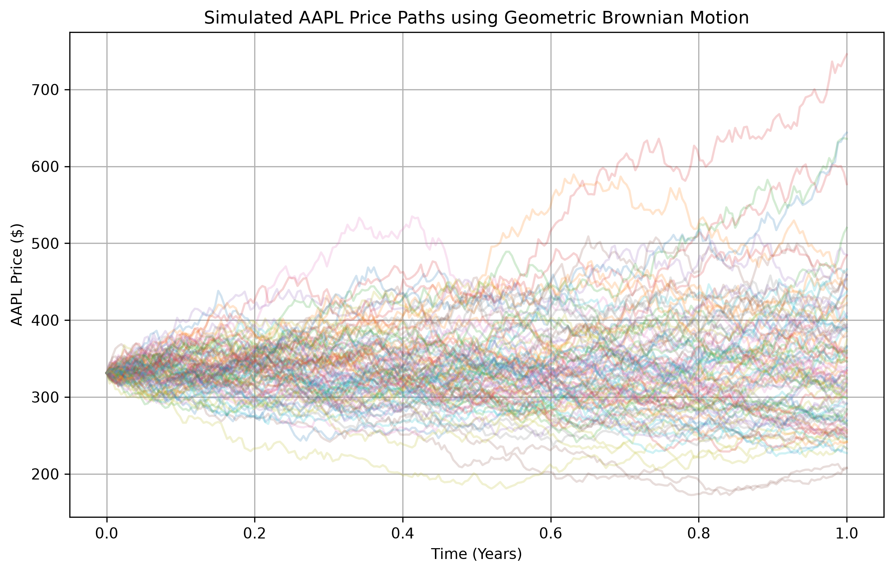
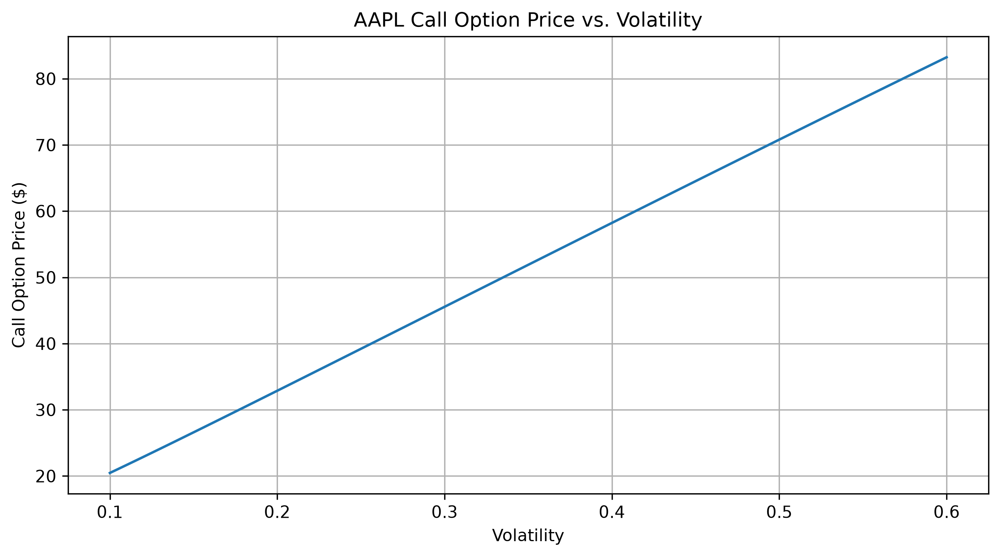
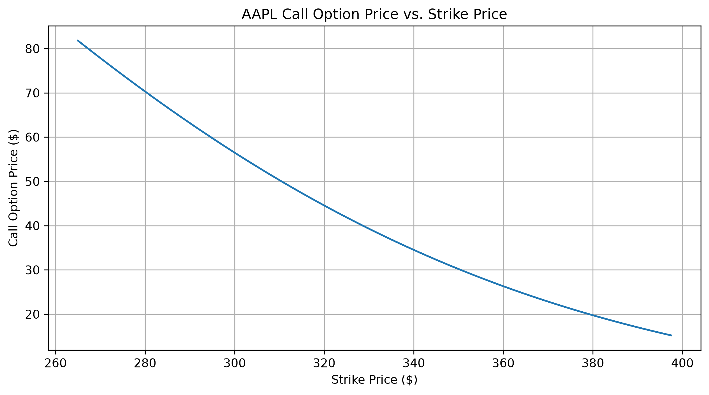
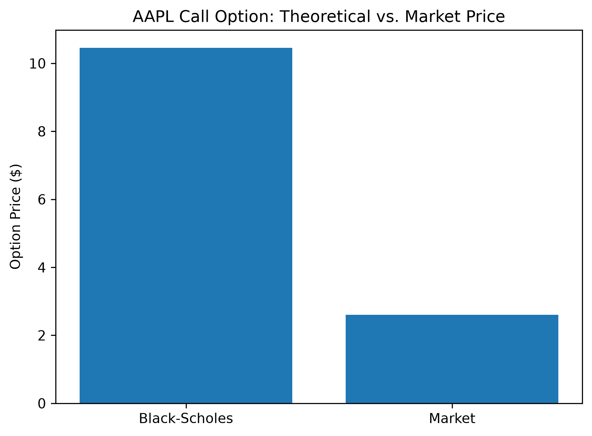

# AAPL Black–Scholes Option Pricing

A quantitative finance project that applies the **Black–Scholes model** to Apple Inc. (AAPL) options using Python and market data.

The project combines historical market data, volatility estimation, stochastic simulation, option pricing, and market-price comparison.

---

## Overview

This project investigates how theoretical option prices can be estimated from AAPL market data.

The workflow is:

```text
AAPL Historical Data
        │
        ▼
Historical Volatility
        │
        ▼
Geometric Brownian Motion
        │
        ▼
Simulated Price Paths
        │
        ▼
Black–Scholes Option Pricing
        │
        ▼
Sensitivity Analysis
        │
        ▼
AAPL Option Chain
        │
        ▼
Theoretical vs. Market Price
```

---

## Key Results

### AAPL Stock Price

Historical AAPL closing prices over the selected period.



### Geometric Brownian Motion

Multiple simulated AAPL price paths generated using a Geometric Brownian Motion model.



### Option Price Sensitivity to Volatility

The Black–Scholes call option price increases as assumed volatility increases.



### Option Price Sensitivity to Strike Price

The theoretical call option price changes as the strike price changes relative to the underlying AAPL price.



### Theoretical vs. Market Price

Comparison between the Black–Scholes theoretical price and the observed AAPL option market price.



---

## Methodology

### 1. Market Data

AAPL historical stock-price data and option-chain data are retrieved using [`yfinance`](https://github.com/ranaroussi/yfinance).

### 2. Historical Volatility

Daily returns are calculated from AAPL closing prices:

$$
r_t = \frac{S_t}{S_{t-1}} - 1
$$

Annualized historical volatility is estimated as:

$$
\sigma = \mathrm{std}(r_t)\sqrt{252}
$$

where 252 represents the approximate number of trading days per year.

### 3. Geometric Brownian Motion

AAPL price paths are simulated using Geometric Brownian Motion:

$$
dS_t = \mu S_tdt + \sigma S_tdW_t
$$

This provides a stochastic representation of possible future price paths.

### 4. Black–Scholes Model

European call and put prices are calculated using the Black–Scholes model.

For a European call:

$$
C = S_0N(d_1) - Ke^{-rT}N(d_2)
$$

For a European put:

$$
P = Ke^{-rT}N(-d_2) - S_0N(-d_1)
$$

where:

$$
d_1 =
\frac{
\ln(S_0/K)+(r+\sigma^2/2)T
}{
\sigma\sqrt{T}
}
$$

$$
d_2=d_1-\sigma\sqrt{T}
$$

---

## Project Structure

```text
aapl-black-scholes/
│
├── README.md
├── requirements.txt
├── pytest.ini
│
├── src/
│   ├── __init__.py
│   ├── black_scholes.py
│   └── greeks.py
│
├── notebooks/
│   └── 01_aapl_option_pricing.ipynb
│
├── tests/
│   └── test_black_scholes.py
│
└── figures/
    ├── aapl_stock_price.png
    ├── gbm_simulation.png
    ├── volatility_sensitivity.png
    ├── strike_sensitivity.png
    └── theoretical_vs_market.png
```

---

## Technologies

* Python 3.11
* NumPy
* SciPy
* pandas
* Matplotlib
* yfinance
* Jupyter Notebook
* pytest

---

## Installation

### 1. Python 3.11

This project requires **Python 3.11**.

Check whether Python 3.11 is installed:

```bash
python3.11 --version
```

#### macOS

If Python 3.11 is not installed, install it with Homebrew:

```bash
brew install python@3.11
```

#### Windows

If Python 3.11 is not installed, install it with `winget`:

```powershell
winget install Python.Python.3.11
```

Then verify:

```powershell
py -3.11 --version
```

#### Ubuntu

If Python 3.11 is not installed:

```bash
sudo apt update
sudo apt install python3.11 python3.11-venv
```

Then verify:

```bash
python3.11 --version
```

---

### 2. Clone the repository

```bash
git clone <repository-url>
cd aapl-black-scholes
```

### 3. Create a virtual environment

```bash
python3.11 -m venv .venv
```

Activate it:

**macOS / Ubuntu**

```bash
source .venv/bin/activate
```

**Windows**

```powershell
.venv\Scripts\activate
```

### 4. Install dependencies

```bash
pip install -r requirements.txt
```

### 5. Run tests

```bash
pytest
```

---

## Testing

The project includes unit tests for:

* European call pricing
* European put pricing
* Put–call parity

Run:

```bash
pytest
```

---

## Limitations

The Black–Scholes model relies on several simplifying assumptions, including constant volatility, continuous trading, and lognormally distributed underlying prices.

The historical volatility used in this project is an estimate based on past AAPL returns and may differ substantially from the volatility implied by current option prices.

The comparison with market prices should therefore be interpreted as an analysis of model assumptions rather than a direct measure of option mispricing.

---

## Disclaimer

This project is for **educational and portfolio purposes only** and does not constitute financial advice or a recommendation to trade securities.

---

## Author

**Hikaru Izumitani**